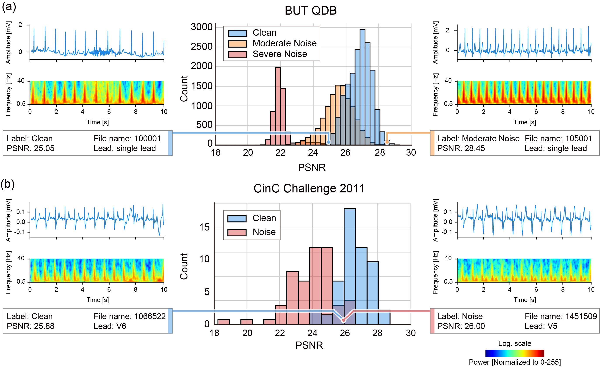

# Diffusion-Based Electrocardiography Noise Quantification via Anomaly Detection

This repository contains the official implementation of  
**"Diffusion-Based Electrocardiography Noise Quantification via Anomaly Detection"**  
[](https://arxiv.org/abs/2506.11815)

## 🔍 Introduction

This study introduces a diffusion-based framework for ECG noise quantification using reconstruction-based anomaly
detection. The model is trained solely on clean ECG signals, learning to reconstruct clean representations from
potentially noisy inputs. **Reconstruction errors serve as a proxy for noise levels** without requiring explicit noise
labels during inference.

- **Noise Quantification**: Peak Signal-to-Noise Ratio (**PSNR**), a robust metric for quantifying distortion in the
  time-frequency domain, is employed. PSNR is inversely proportional to noise levels:
    - **Lower PSNR** 📉💥 indicates **higher noise**.
    - **Higher PSNR** indicates **better signal quality**.

Our optimized model achieves robust noise quantification with only **three reverse diffusion steps**, ensuring efficient
and scalable real-world applicability.

### 🖼️ Limitations of Human Labels in ECG Noise Assessment



**Figure** demonstrates the practical utility of PSNR-based segment analysis and Wasserstein-1 distance (**$W_1$**)
-based evaluation (leveraging PSNR distributions):

- **(a)** Examples from the BUT QDB dataset highlight discrepancies where a segment labeled as "Clean" by humans
  exhibited a lower PSNR (higher noise) compared to another segment labeled "Moderate Noise." Specifically,
  noise-labeled samples with high PSNR appeared visually clean, whereas clean-labeled samples with low PSNR clearly
  exhibited noise artifacts.

- **(b)** Analysis of data from the **CinC Challenge 2011** dataset revealed significant overlap in PSNR distributions
  between human-labeled clean and noisy segments. Further visual inspection (Figure (b)) confirmed these overlapping
  segments indeed exhibited similar noise characteristics, underscoring the limitations of human annotations.

<br>

## ⚙️ Installation
Clone the repository and install required dependencies:
```bash
git clone https://github.com/Taeseong-Han/ECGNoiseQuantification.git
cd ECGNoiseQuantification
pip install -r requirements.txt
```
#### ✅ Environment
This project was developed and tested on the Python: 3.8.10 environment

#### ⚠️ CUDA Compatibility
Due to CUDA version compatibility, install the following packages after installing requirements.txt
```bash
# PyTorch (CUDA 11.8)
pip install torch==2.1.1 torchvision==0.16.1 --index-url https://download.pytorch.org/whl/cu118

# JAX (CUDA 11.8 + cuDNN 8.2)
pip install jaxlib==0.3.25+cuda11.cudnn82 -f https://storage.googleapis.com/jax-releases/jax_cuda_releases.html
pip install jax==0.3.15
```
🔧 Adjust versions if you're using a different CUDA version

<br>

## 🧪 Example Usage

#### 🔗 Pretrained Model

You can download the pretrained latent diffusion model from 🤗 Hugging Face:

👉 [Download pretrained model](https://huggingface.co/Taeseong-Han/ECGNoiseQuantification/blob/main/pretrained_ldm.pth)

#### 💻 Inference Example

Higher PSNR values indicate better signal quality, corresponding to lower noise levels.
In practice, a PSNR threshold of approximately 24 effectively distinguishes severely degraded ECG segments from
acceptable ones.

see [demo.ipynb](https://github.com/Taeseong-Han/ECGNoiseQuantification/blob/main/demo.ipynb) or use the following code
snippet:

```python
import numpy as np
from utils.inference import ecg_noise_quantification

checkpoint_path = "[YOUR_PATH]/pretrained_ldm.pth"
ecg = np.random.randn(12,5000)

output = ecg_noise_quantification(
    ecg=ecg,  # numpy array of shape (leads, timepoints)
    sampling_freq=500,  # sampling frequency in Hz
    checkpoint_path=checkpoint_path,
    return_images=True,
)

output.psnr: np.ndarray  # shape: (leads, segments)
output.original_image: np.ndarray  # shape: (leads, segments, H, W)
output.cleaned_image: np.ndarray  # shape: (leads, segments, H, W)
```

> The input ECG is automatically segmented into 10-second windows, each of which is converted into a time-frequency
> representation via superlet transform. These scalograms are then fed into the pretrained diffusion model for
> reconstruction-based anomaly detection.
>
>The output includes segment-level original and denoised scalograms, along with the corresponding PSNR values for each
> segment.
>

<br>
<br>

## 🧬 Reproducibility: Data Preprocessing and Training

This section provides step-by-step instructions to:

- Convert raw PTB-XL ECG data into time-frequency representations
- Train the autoencoder used in latent diffusion
- Run noise quantification and evaluation
- Refine training data based on reconstruction-based noise analysis

---

#### 🖼️ Framework Overview


---

### 🔄 Superlet Transform on PTB-XL Data

To convert raw PTB-XL ECG recordings into superlet scalograms, run the following command from the project root:

```bash
python -m preprocessing.superlet_transform_ptbxl \
  --ptbxl_raw_path [PTBXL_RAW_PATH]
```

Replace [PTBXL_RAW_PATH] with the full path to your downloaded PTB-XL dataset , e.g.:

```bash
--ptbxl_raw_path ~/Database/physionet.org/files/ptb-xl/1.0.3
```

📥 **Download the dataset from PhysioNet:**

🔗 https://physionet.org/content/ptb-xl/1.0.3/

<br>

### 🏋️Train Model

Train the autoencoder on discretized superlet scalograms:

```bash
python -m train.train_autoencoder \
  --discretization \
  --save_path [YOUR MODEL PATH]
```

This model compresses input scalograms into a latent space and is a required pretraining step for training the latent
diffusion model.
If you're using the vanilla diffusion model, you can train it directly without this autoencoder stage.
You can customize training using additional CLI options.

> ⚠️ The training script structure is unified across this project.  
> The same CLI pattern applies to training:
>
> - `train_autoencoder`
> - `train_latent_diffusion`
> - `train_vanilla_diffusion`
>
> Simply execute:
>
> ```bash
> python -m train.[script_name] [options]
> ```

<br>

### 📊 Noise Level Quantification

Quantify ECG signal noise using a pretrained diffusion model.
Reconstruction metrics like PSNR serve as proxies for noise severity.

This outputs per-lead metrics (PSNR, SSIM, etc.) in CSV format for further analysis.

```bash
python -m evaluation.run_noise_quantification \
  --checkpoint [YOUR MODEL PATH] \
  --timestep 250 \
  --noise_scheduler_type ddim \
  --step_interval 10 \
  --discretization \
  --output_dir ./evaluation/results
```

To evaluate all 10 folds (not just the test set), include:

```bash
--include_all_folds
```

<br>

### 📈 Performance Evaluation Across Experiments

Compare multiple model configurations by computing Wasserstein-1 distances (W₁) between metric distributions:

```bash
python -m evaluation.eval_models \
  --keyword ddpm \
  --output_dir ./evaluation/results
```

**Arguments:**

- --keyword: Substring used to filter result files (e.g., 'ddpm', 't250', etc.)

This helps quantify how well different models separate clean and noisy segments under various noise types (static,
burst, baseline).

<br>

### 🧹 Dataset Refinement and Retraining

Improve training by filtering clean segments based on model, not human labels.

#### Step 1. Quantify Noise Across All Folds

Run noise quantification over the full PTB-XL dataset, including clean-labeled segments:

```bash
python -m evaluation.run_noise_quantification \
  --checkpoint  [YOUR MODEL PATH] \
  --timestep 250 \
  --noise_scheduler_type ddpm \
  --include_all_folds \
  --discretization \
  --output_dir ./evaluation/results

```

This provides reconstruction-based quality scores (e.g., PSNR) for every segment in the dataset.

#### Step 2: Select High-Confidence Clean Segments and Retrain

Identify top-N% of clean segments with the highest quality (e.g., PSNR)
under the model that showed strong sensitivity to static and burst noise (high W₁-distance):

```bash
python -m train.retrain_autoencoder \
  --static_file ./evaluation/results/dm_ddpm_t250_psnr.csv \
  --burst_file ./evaluation/results/ldm_ddpm_t50_psnr.csv \
  --metric psnr \
  --static_percentage 0.5 \
  --burst_percentage 0.5 \
  --discretization \
  --save_path ./output/ae_model_refined
```

This filters out mislabeled or ambiguous clean segments and enables retraining on a refined,
high-confidence subset of the original dataset.

<br>

---

## 📄 License and Citation

The software is licensed under the MIT License 2.0.  
Please cite the following paper if you use this code:

```bibtex
@misc{han2025diffusionbasedelectrocardiographynoisequantification,
  title={Diffusion-Based Electrocardiography Noise Quantification via Anomaly Detection}, 
  author={Tae-Seong Han and Jae-Wook Heo and Hakseung Kim and Cheol-Hui Lee and Hyub Huh and Eue-Keun Choi and Dong-Joo Kim},
  year={2025},
  eprint={2506.11815},
  archivePrefix={arXiv},
  primaryClass={eess.SP},
  url={https://arxiv.org/abs/2506.11815}
}
```